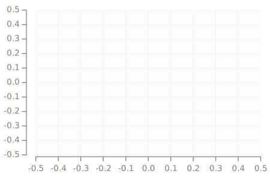

chart-svg
=========

[](https://travis-ci.org/tonyday567/chart-svg)
[](https://hackage.haskell.org/package/chart-svg)
[](http://stackage.org/lts/package/chart-svg)
[](http://stackage.org/nightly/package/chart-svg)

A chart library targetting SVG.


test charts
=========

mempty
---

`writeCharts "other/mempty.svg" []` produces the following svg:

```

<svg xmlns="http://www.w3.org/2000/svg" height="300.0" viewBox="-0.77 -0.52 1.54 1.04" width="450.0" xmlns:xlink="http://www.w3.org/1999/xlink">
</svg>
```

The default Svg options are for a height of 300 and an aspect ratio (width/height) of 1.5. The viewBox is centered on (0,0) with height of 1 and a width of the aspect ratio with an extra 0.02 of outer padding in all 4 directions.

unit
---

`[Chart (RectA defaultRectStyle) [SpotRect unitRect]]`


```

<svg xmlns="http://www.w3.org/2000/svg" height="300.0" viewBox="-0.7725 -0.5225 1.545 1.045" width="450.0" xmlns:xlink="http://www.w3.org/1999/xlink">
  <g stroke-opacity="0.5" fill-opacity="0.5" stroke="#666666" stroke-width="5.0e-3" fill="#ff0000">
    <rect height="1.0" width="1.5" x="-0.75" y="-0.5"/>
  </g>
</svg>
```

Huds & HudOptions
===

`defaultHudOptions`




Chart Types
===

rect


line


text


glyph


bar


pixel


tests
===

boundText


compound


label


legend


recipe
------
```
stack build --exec "$(stack path --local-install-root)/bin/examples" --file-watch
```

reference
---------

-   [SVG2](https://www.w3.org/TR/SVG2/)
-   [MDN svg](https://developer.mozilla.org/en-US/docs/Web/SVG/Tutorial)
-   [lucid](http://hackage.haskell.org/package/lucid)
-   [lucid-svg](http://hackage.haskell.org/package/lucid-svg)

